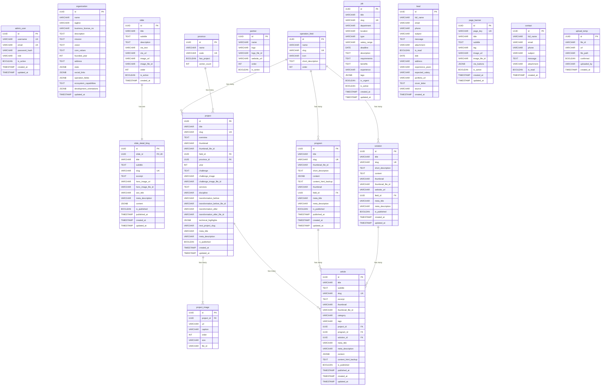

# VDCD Database — Table Descriptions (PostgreSQL 15+)

---

## admin_user

| No | Field | Data type | Constraints | Description |
| ---: | --- | --- | --- | --- |
| 1 | id | UUID | Primary Key, Not Null | Unique identifier for each admin |
| 2 | username | VARCHAR(100) | Not Null, Unique | Login username |
| 3 | email | VARCHAR(255) | Not Null, Unique | Login email |
| 4 | password_hash | VARCHAR(255) | Not Null | Hashed password |
| 5 | role | VARCHAR(50) | Not Null, Default: `editor` · CHECK (`superadmin`, `editor`, `viewer`) | Authorization role |
| 6 | is_active | BOOLEAN | Not Null, Default: TRUE | Account status |
| 7 | created_at | TIMESTAMP | Not Null, Default: NOW() | Account creation timestamp |
| 8 | updated_at | TIMESTAMP | Not Null, Default: NOW() | Last updated timestamp |

---

## organization

**Description:** Single-row config — stores VDCD organization metadata & profile

| No | Field | Data type | Constraints | Description |
| ---: | --- | --- | --- | --- |
| 1 | id | UUID | Primary Key, Not Null | Unique identifier |
| 2 | name | VARCHAR(255) | Not Null | Full organization name |
| 3 | tagline | VARCHAR(255) | Nullable | Tagline / Slogan |
| 4 | business_license_no | VARCHAR(50) | Nullable | Business license number (Giấy CNĐKKD) |
| 5 | description | TEXT | Nullable | Organization description (rich text) |
| 6 | mission | TEXT | Nullable | Mission statement |
| 7 | vision | TEXT | Nullable | Vision |
| 8 | core_values | TEXT | Nullable | Core values |
| 9 | founded_year | INT | Nullable | Year founded |
| 10 | address | TEXT | Nullable | Physical office / headquarters address |
| 11 | stats | JSONB | Nullable | Statistics: `{ provinces, centers, projects, staff, experts, ... }` |
| 12 | social_links | JSONB | Nullable | Social networks: `{ facebook, zalo, youtube, ... }` |
| 13 | operation_fields | JSONB | Nullable | Operation fields on About page: `Array<{ title: string, description: string }>` |
| 14 | ecosystem_capabilities | TEXT | Nullable | Inherited capabilities from VDCD ecosystem (Năng lực kế thừa) |
| 15 | development_orientations | JSONB | Nullable | Development orientations: `Array<{ title: string, description: string }>` |
| 16 | updated_at | TIMESTAMP | Not Null, Default: NOW() | Last updated timestamp |

---

## slide

**Description:** Manage homepage slideshow

| No | Field | Data type | Constraints | Description |
| ---: | --- | --- | --- | --- |
| 1 | id | UUID | Primary Key, Not Null | Unique identifier |
| 2 | title | VARCHAR(255) | Not Null | Slide title |
| 3 | subtitle | TEXT | Nullable | Secondary headline / subtitle |
| 4 | description | TEXT | Nullable | Short description on slide |
| 5 | cta_text | VARCHAR(100) | Nullable | CTA button text (e.g.: "Tìm hiểu thêm") |
| 6 | cta_url | VARCHAR(500) | Nullable | CTA button link |
| 7 | image_url | VARCHAR(500) | Not Null | Slide background image URL |
| 8 | image_file_id | VARCHAR | Nullable | ImageKit file ID for image management |
| 9 | order | INT | Not Null, Default: 0 | Display order |
| 10 | is_active | BOOLEAN | Not Null, Default: TRUE | Enable/disable slide |
| 11 | created_at | TIMESTAMP | Not Null, Default: NOW() | Creation timestamp |

*Relation:* Has a 1-to-1 relationship with `slide_detail_blog`.

---

## slide_detail_blog

**Description:** In-depth blog/article attached 1-to-1 to a slide, edited via Visual Block Editor

| No | Field | Data type | Constraints | Description |
| ---: | --- | --- | --- | --- |
| 1 | id | UUID | Primary Key, Not Null | Unique identifier |
| 2 | slide_id | UUID | Not Null, Unique, FK → `slide.id`, On Delete CASCADE | Associated slide |
| 3 | title | VARCHAR(255) | Not Null | Blog title |
| 4 | subtitle | TEXT | Nullable | Blog subtitle |
| 5 | slug | VARCHAR(255) | Not Null, Unique | SEO URL slug |
| 6 | excerpt | TEXT | Nullable | Short excerpt / summary |
| 7 | hero_image_url | VARCHAR(500) | Nullable | Hero cover image URL |
| 8 | hero_image_file_id | VARCHAR | Nullable | ImageKit file ID for hero image |
| 9 | seo_title | VARCHAR(255) | Nullable | SEO title |
| 10 | meta_description | VARCHAR(500) | Nullable | SEO meta description |
| 11 | content | JSONB | Not Null, Default: `'{"version":1,"blocks":[]}'` | Structured block content (Document Model) |
| 12 | is_published | BOOLEAN | Not Null, Default: FALSE | Publication status |
| 13 | published_at | TIMESTAMP | Nullable | Official publication timestamp |
| 14 | created_at | TIMESTAMP | Not Null, Default: NOW() | Creation timestamp |
| 15 | updated_at | TIMESTAMP | Not Null, Default: NOW() | Last updated timestamp |

---

## province

**Description:** List of Vietnamese provinces/cities used for the interactive project map

| No | Field | Data type | Constraints | Description |
| ---: | --- | --- | --- | --- |
| 1 | id | UUID | Primary Key, Not Null | Unique identifier |
| 2 | name | VARCHAR(100) | Not Null | Province/city name |
| 3 | code | VARCHAR(10) | Not Null, Unique | Standard Vietnamese province code (used to map with GeoJSON) |
| 4 | has_project | BOOLEAN | Not Null, Default: FALSE | Whether the province has any projects |
| 5 | center_count | INT | Not Null, Default: 0 | Number of centers/branches in the province |

---

## partner

**Description:** Clients & partners (logo display carousel / grid)

| No | Field | Data type | Constraints | Description |
| ---: | --- | --- | --- | --- |
| 1 | id | UUID | Primary Key, Not Null | Unique identifier |
| 2 | name | VARCHAR(255) | Not Null | Organization / company name |
| 3 | logo | VARCHAR(500) | Not Null | Logo URL (transparent background PNG / WebP) |
| 4 | logo_file_id | VARCHAR | Nullable | ImageKit file ID for logo |
| 5 | website_url | VARCHAR(500) | Nullable | Partner external website link |
| 6 | order | INT | Not Null, Default: 0 | Display order |
| 7 | is_active | BOOLEAN | Not Null, Default: TRUE | Enable/disable display |

---

## operation_field

**Description:** Operation fields (used to categorize programs, solutions, projects)

| No | Field | Data type | Constraints | Description |
| ---: | --- | --- | --- | --- |
| 1 | id | UUID | Primary Key, Not Null | Unique identifier |
| 2 | name | VARCHAR(100) | Not Null | Field name (e.g.: Nông nghiệp công nghệ cao, Đô thị thông minh) |
| 3 | slug | VARCHAR(100) | Not Null, Unique | SEO-friendly URL slug |
| 4 | icon | VARCHAR(100) | Nullable | Representative icon identifier / URL |
| 5 | short_description | TEXT | Nullable | Short field description |
| 6 | order | INT | Not Null, Default: 0 | Display order |

---

## program

**Description:** Programs initiated or organized by VDCD, edited via Visual Block Editor (Document Model)

| No | Field | Data type | Constraints | Description |
| ---: | --- | --- | --- | --- |
| 1 | id | UUID | Primary Key, Not Null | Unique identifier |
| 2 | title | VARCHAR(255) | Not Null | Program name |
| 3 | slug | VARCHAR(255) | Not Null, Unique | URL slug |
| 4 | thumbnail_file_id | VARCHAR | Nullable | ImageKit file ID for thumbnail |
| 5 | short_description | TEXT | Nullable | Short description (displayed on list page) |
| 6 | content | JSONB | Not Null, Default: `'{"version":1,"blocks":[]}'` | Structured block content (Document Model) |
| 7 | content_html_backup | TEXT | Nullable, `select: false` | Backup of legacy HTML content (100% data preservation) |
| 8 | thumbnail | VARCHAR(500) | Nullable | Thumbnail image URL |
| 9 | field_id | UUID | Nullable, FK → `operation_field.id`, On Delete SET NULL | Associated operation field |
| 10 | meta_title | VARCHAR(255) | Nullable | SEO meta title |
| 11 | meta_description | VARCHAR(255) | Nullable | SEO meta description |
| 12 | is_published | BOOLEAN | Not Null, Default: FALSE | Published status |
| 13 | published_at | TIMESTAMP | Nullable | Official publication timestamp |
| 14 | created_at | TIMESTAMP | Not Null, Default: NOW() | Creation timestamp |
| 15 | updated_at | TIMESTAMP | Not Null, Default: NOW() | Last updated timestamp |

---

## solution

**Description:** Solutions and technological products provided by VDCD

| No | Field | Data type | Constraints | Description |
| ---: | --- | --- | --- | --- |
| 1 | id | UUID | Primary Key, Not Null | Unique identifier |
| 2 | title | VARCHAR(255) | Not Null | Solution name |
| 3 | slug | VARCHAR(255) | Not Null, Unique | URL slug |
| 4 | short_description | TEXT | Nullable | Short description (displayed on list page) |
| 5 | content | TEXT | Nullable | Detailed content (rich text HTML) |
| 6 | thumbnail | VARCHAR(500) | Nullable | Thumbnail image URL |
| 7 | thumbnail_file_id | VARCHAR | Nullable | ImageKit file ID for thumbnail |
| 8 | website_url | VARCHAR(500) | Nullable | External product / demo website URL |
| 9 | field_id | UUID | Nullable, FK → `operation_field.id`, On Delete SET NULL | Associated operation field |
| 10 | meta_title | VARCHAR(255) | Nullable | SEO meta title |
| 11 | meta_description | VARCHAR(255) | Nullable | SEO meta description |
| 12 | is_published | BOOLEAN | Not Null, Default: FALSE | Published status |
| 13 | created_at | TIMESTAMP | Not Null, Default: NOW() | Creation timestamp |
| 14 | updated_at | TIMESTAMP | Not Null, Default: NOW() | Last updated timestamp |

---

## project

**Description:** Projects executed by VDCD with extensive case-study and transformation details

| No | Field | Data type | Constraints | Description |
| ---: | --- | --- | --- | --- |
| 1 | id | UUID | Primary Key, Not Null | Unique identifier |
| 2 | title | VARCHAR(255) | Not Null | Project name |
| 3 | slug | VARCHAR(255) | Not Null, Unique | URL slug |
| 4 | overview | TEXT | Nullable | Project overview (rich text HTML) |
| 5 | thumbnail | VARCHAR(500) | Nullable | Thumbnail image URL |
| 6 | thumbnail_file_id | VARCHAR | Nullable | ImageKit file ID for thumbnail |
| 7 | field_id | UUID | Nullable, FK → `operation_field.id`, On Delete SET NULL | Associated operation field |
| 8 | province_id | UUID | Nullable, FK → `province.id`, On Delete SET NULL | Implementation province/city |
| 9 | year | INT | Nullable | Project implementation year |
| 10 | challenge | TEXT | Nullable | Detailed problem/challenge description (HTML) |
| 11 | challenge_image | VARCHAR(500) | Nullable | Challenge section illustration URL |
| 12 | challenge_image_file_id | VARCHAR | Nullable | ImageKit file ID for challenge image |
| 13 | services | TEXT | Nullable | List of provided services (stored as simple-array: string[]) |
| 14 | discipline | VARCHAR(255) | Nullable | Project discipline / engineering area |
| 15 | transformation_before | VARCHAR(500) | Nullable | Transformation "Before" image URL |
| 16 | transformation_before_file_id | VARCHAR | Nullable | ImageKit file ID for "Before" image |
| 17 | transformation_after | VARCHAR(500) | Nullable | Transformation "After" image URL |
| 18 | transformation_after_file_id | VARCHAR | Nullable | ImageKit file ID for "After" image |
| 19 | technical_highlights | JSONB | Nullable | Key metrics / technical highlights: `Array<{ label: string, value: string }>` |
| 20 | next_project_slug | VARCHAR(255) | Nullable | Slug of the next project for detail page navigation |
| 21 | meta_title | VARCHAR(255) | Nullable | SEO meta title |
| 22 | meta_description | VARCHAR(255) | Nullable | SEO meta description |
| 23 | is_published | BOOLEAN | Not Null, Default: FALSE | Published status |
| 24 | created_at | TIMESTAMP | Not Null, Default: NOW() | Creation timestamp |
| 25 | updated_at | TIMESTAMP | Not Null, Default: NOW() | Last updated timestamp |

---

## project_image

**Description:** Project gallery and media showcase

| No | Field | Data type | Constraints | Description |
| ---: | --- | --- | --- | --- |
| 1 | id | UUID | Primary Key, Not Null | Unique identifier |
| 2 | project_id | UUID | Not Null, FK → `project.id`, On Delete CASCADE | Project that owns this image |
| 3 | url | VARCHAR(500) | Not Null | Image URL |
| 4 | caption | VARCHAR(255) | Nullable | Image caption |
| 5 | order | INT | Not Null, Default: 0 | Display order in gallery |
| 6 | size | VARCHAR(20) | Not Null, Default: `'small'` · CHECK (`small`, `large`) | Display size in UI grid |
| 7 | file_id | VARCHAR | Nullable | ImageKit file ID |

---

## article

**Description:** Articles / News / Case-studies (linkable to projects, programs, or solutions for SEO), edited via Visual Block Editor (Document Model)

| No | Field | Data type | Constraints | Description |
| ---: | --- | --- | --- | --- |
| 1 | id | UUID | Primary Key, Not Null | Unique identifier |
| 2 | title | VARCHAR(255) | Not Null | Article title |
| 3 | subtitle | TEXT | Nullable | Article subtitle / brand eyebrow text |
| 4 | slug | VARCHAR(255) | Not Null, Unique | URL slug |
| 5 | excerpt | TEXT | Nullable | Lead excerpt / short summary |
| 6 | thumbnail | VARCHAR(500) | Nullable | Thumbnail image URL |
| 7 | thumbnail_file_id | VARCHAR | Nullable | ImageKit file ID for thumbnail |
| 8 | category | VARCHAR(100) | Nullable | Article category |
| 9 | tags | VARCHAR(255) | Nullable | Comma-separated tags |
| 10 | project_id | UUID | Nullable, FK → `project.id`, On Delete SET NULL | Linked project |
| 11 | program_id | UUID | Nullable, FK → `program.id`, On Delete SET NULL | Linked program |
| 12 | solution_id | UUID | Nullable, FK → `solution.id`, On Delete SET NULL | Linked solution |
| 13 | meta_title | VARCHAR(255) | Nullable | SEO meta title |
| 14 | meta_description | VARCHAR(500) | Nullable | SEO meta description |
| 15 | content | JSONB | Not Null, Default: `'{"version":1,"blocks":[]}'` | Structured block content (Document Model) |
| 16 | content_html_backup | TEXT | Nullable, `select: false` | Backup of legacy HTML content (100% data preservation) |
| 17 | is_published | BOOLEAN | Not Null, Default: FALSE | Published status |
| 18 | published_at | TIMESTAMP | Nullable | Official publication timestamp |
| 19 | created_at | TIMESTAMP | Not Null, Default: NOW() | Creation timestamp |
| 20 | updated_at | TIMESTAMP | Not Null, Default: NOW() | Last updated timestamp |

---

## job

**Description:** Recruitment postings and job openings

| No | Field | Data type | Constraints | Description |
| ---: | --- | --- | --- | --- |
| 1 | id | UUID | Primary Key, Not Null | Unique identifier |
| 2 | title | VARCHAR(255) | Not Null | Job opening title |
| 3 | slug | VARCHAR(255) | Not Null, Unique | URL slug |
| 4 | department | VARCHAR(100) | Nullable | Department / Division |
| 5 | location | VARCHAR(255) | Nullable | Work location (e.g. Gia Lai, Remote) |
| 6 | type | VARCHAR(50) | Not Null, CHECK (`full-time`, `part-time`, `intern`, `contract`) | Employment contract type |
| 7 | salary_range | VARCHAR(100) | Nullable | Salary range (e.g.: 15 - 25 triệu) |
| 8 | deadline | DATE | Nullable | Application deadline |
| 9 | description | TEXT | Nullable | Job description (rich text HTML) |
| 10 | requirements | TEXT | Nullable | Candidate requirements (rich text HTML) |
| 11 | benefits | TEXT | Nullable | Benefits and perks (rich text HTML) |
| 12 | experience | VARCHAR(100) | Nullable | Required experience (e.g.: "1 - 3 năm") |
| 13 | tags | JSONB | Nullable | Required skill tags array (e.g.: `["NestJS", "React"]`) |
| 14 | is_urgent | BOOLEAN | Not Null, Default: FALSE | Display "Tuyển gấp" badge |
| 15 | is_active | BOOLEAN | Not Null, Default: TRUE | Active status |
| 16 | created_at | TIMESTAMP | Not Null, Default: NOW() | Creation timestamp |
| 17 | updated_at | TIMESTAMP | Not Null, Default: NOW() | Last updated timestamp |

---

## lead

**Description:** Career applications and detailed lead submissions

| No | Field | Data type | Constraints | Description |
| ---: | --- | --- | --- | --- |
| 1 | id | UUID | Primary Key, Not Null | Unique identifier |
| 2 | full_name | VARCHAR(255) | Not Null | Applicant full name |
| 3 | email | VARCHAR(255) | Not Null | Contact email |
| 4 | phone | VARCHAR(20) | Nullable | Contact phone number |
| 5 | subject | VARCHAR(255) | Nullable | Applied position / Subject |
| 6 | message | TEXT | Nullable | Introduction message / Note |
| 7 | attachment | VARCHAR(500) | Nullable | CV / Resume attachment URL |
| 8 | is_read | BOOLEAN | Not Null, Default: FALSE | Read/unread status by admin |
| 9 | dob | DATE | Nullable | Date of birth |
| 10 | address | VARCHAR(255) | Nullable | Current address |
| 11 | experience_years | VARCHAR(100) | Nullable | Years of experience |
| 12 | expected_salary | VARCHAR(100) | Nullable | Expected salary |
| 13 | portfolio_url | VARCHAR(500) | Nullable | Portfolio / GitHub / LinkedIn URL |
| 14 | cover_letter | TEXT | Nullable | Cover letter content |
| 15 | source | VARCHAR(50) | Nullable | Source channel (`career_form`, `contact_form`, `landing_page`) |
| 16 | created_at | TIMESTAMP | Not Null, Default: NOW() | Submission timestamp |

---

## page_banner

**Description:** Manage top banners and headers for specific pages

| No | Field | Data type | Constraints | Description |
| ---: | --- | --- | --- | --- |
| 1 | id | UUID | Primary Key, Not Null | Unique identifier |
| 2 | page_key | VARCHAR(50) | Not Null, Unique | Key identifying the page (e.g. `careers`, `projects`, `programs`, `news`, `contact`, `about`, `solutions`) |
| 3 | title | VARCHAR(255) | Not Null | Banner title |
| 4 | subtitle | TEXT | Nullable | Banner secondary text / subtitle |
| 5 | tag | VARCHAR(100) | Nullable | Eyebrow tag / pill label |
| 6 | image_url | VARCHAR(500) | Not Null | Banner background image URL |
| 7 | image_file_id | VARCHAR | Nullable | ImageKit file ID |
| 8 | cta_buttons | JSONB | Nullable | CTA buttons array: `Array<{ label: string, href: string, variant?: string, ariaLabel?: string }>` |
| 9 | is_active | BOOLEAN | Not Null, Default: TRUE | Display toggle |
| 10 | created_at | TIMESTAMP | Not Null, Default: NOW() | Creation timestamp |
| 11 | updated_at | TIMESTAMP | Not Null, Default: NOW() | Last updated timestamp |

---

## contact

**Description:** General public contact inquiries

| No | Field | Data type | Constraints | Description |
| ---: | --- | --- | --- | --- |
| 1 | id | UUID | Primary Key, Not Null | Unique identifier |
| 2 | full_name | VARCHAR(255) | Not Null | Contact person full name |
| 3 | email | VARCHAR(255) | Not Null | Contact email |
| 4 | phone | VARCHAR(20) | Nullable | Phone number |
| 5 | subject | VARCHAR(255) | Nullable | Inquiry subject |
| 6 | message | TEXT | Nullable | Message content |
| 7 | attachment | VARCHAR(500) | Nullable | Optional file attachment URL |
| 8 | is_read | BOOLEAN | Not Null, Default: FALSE | Read/unread status |
| 9 | created_at | TIMESTAMP | Not Null, Default: NOW() | Submission timestamp |

---

## upload_temp

**Description:** Temporary log and confirmation registry for uploaded files before entity persistence

| No | Field | Data type | Constraints | Description |
| ---: | --- | --- | --- | --- |
| 1 | id | UUID | Primary Key, Not Null | Unique identifier |
| 2 | file_id | VARCHAR | Not Null | ImageKit file ID |
| 3 | url | VARCHAR | Not Null | Uploaded file CDN URL |
| 4 | file_path | VARCHAR | Not Null | Path/folder in storage |
| 5 | confirmed | BOOLEAN | Not Null, Default: FALSE | Whether file has been linked to a permanent record |
| 6 | uploaded_by | VARCHAR | Nullable | User ID or IP of uploader |
| 7 | created_at | TIMESTAMP | Not Null, Default: NOW() | Upload timestamp |

---

# Indexes

| Index Name | Table | Column(s) | Description |
| --- | --- | --- | --- |
| `idx_program_slug` / `UQ` | program | `slug` (UNIQUE) | Fast program lookup by unique slug |
| `IDX_program_field_id` | program | `field_id` | Filter programs by operation field |
| `IDX_program_is_published` | program | `is_published` | Filter published programs |
| `IDX_program_published_at` | program | `published_at DESC` | Sort programs by publication date |
| `idx_solution_slug` / `UQ` | solution | `slug` (UNIQUE) | Fast solution lookup by unique slug |
| `idx_solution_field` | solution | `field_id` | Filter solutions by operation field |
| `idx_project_slug` / `UQ` | project | `slug` (UNIQUE) | Fast project lookup by unique slug |
| `idx_project_field` | project | `field_id` | Filter projects by operation field |
| `idx_project_province` | project | `province_id` | Filter projects by province/city |
| `idx_project_year` | project | `year` | Filter projects by year |
| `idx_project_image_proj` | project_image | `project_id` | Query gallery images by project |
| `idx_article_slug` / `UQ` | article | `slug` (UNIQUE) | Fast article lookup by unique slug |
| `IDX_article_category` | article | `category` | Filter articles by category |
| `IDX_article_is_published` | article | `is_published` | Filter published articles |
| `IDX_article_published_at` | article | `published_at DESC` | Sort articles by publication date |
| `IDX_article_project_id` | article | `project_id` | Filter articles by project |
| `IDX_article_program_id` | article | `program_id` | Filter articles by program |
| `IDX_article_solution_id` | article | `solution_id` | Filter articles by solution |
| `idx_lead_created` | lead | `created_at DESC` | Sort leads by submission date |
| `idx_lead_is_read` | lead | `is_read` | Filter leads by read status |
| `idx_contact_created` | contact | `created_at DESC` | Sort contacts by submission date |
| `idx_contact_is_read` | contact | `is_read` | Filter contacts by read status |
| `UQ_ffbeb96e47682dd086b086cd6ec` | page_banner | `page_key` (UNIQUE) | Fast lookup by unique page key |
| `IDX_slide_detail_blog_slide_id` | slide_detail_blog | `slide_id` (UNIQUE) | 1-to-1 lookup from slide to detail blog |
| `IDX_slide_detail_blog_is_published` | slide_detail_blog | `is_published` | Filter published blogs |
| `IDX_slide_detail_blog_published_at` | slide_detail_blog | `published_at DESC` | Sort blogs by publish date |

---

# Entity Relationship Diagram



---

# Block-based Document Model (`content` JSONB Specification)

Three tables in the database store rich, structured editorial content as JSONB rather than legacy HTML text:
1. `slide_detail_blog` (`content` JSONB)
2. `article` (`content` JSONB)
3. `program` (`content` JSONB)

All three tables share the exact same standardized **Document Model** (`version: 1`), enabling unified validation, parsing, editing, and frontend rendering across the entire VDCD platform.

### Document Root Schema

```json
{
  "version": 1,
  "heroMeta": {
    "caption": "Optional caption for hero image/thumbnail",
    "placement": "above_title",
    "focalPoint": { "x": 50, "y": 50 }
  },
  "blocks": [
    /* Array of block objects */
  ]
}
```

| Field | Type | Required | Description |
| :--- | :--- | :---: | :--- |
| `version` | `number` | Yes | Schema specification version (currently `1`) |
| `heroMeta` | `object` | No | Metadata for hero media presentation |
| `heroMeta.caption` | `string` | No | Caption text displayed underneath the hero image |
| `heroMeta.placement` | `string` | No | Placement mode: `"above_title"`, `"below_title"`, `"bottom"`, `"hidden"` |
| `heroMeta.focalPoint`| `object` | No | Visual crop anchor `{ x: number, y: number }` (0-100%) |
| `blocks` | `Block[]` | Yes | Ordered array of content blocks |

---

### Standard Block Specifications

Every block in `blocks` must include a unique `id` and a recognized `type`. Optional `spacing: { marginTop?: number, marginBottom?: number }` is supported on all block types.

#### 1. Heading Block (`type: "heading"`)
```json
{
  "id": "blk_h2_01",
  "type": "heading",
  "level": 2,
  "text": "Mục tiêu chiến lược giai đoạn 2026 – 2030",
  "spacing": { "marginTop": 24, "marginBottom": 16 }
}
```
- `level`: `number` (1, 2, 3, 4, 5, 6). Typically `level: 2` (H2) or `level: 3` (H3) within article/program bodies.
- `text`: `string` (plain text).

#### 2. Paragraph Block (`type: "paragraph"`)
```json
{
  "id": "blk_p_01",
  "type": "paragraph",
  "text": "Trung tâm Đổi mới Sáng tạo Gia Lai đóng vai trò là <strong>hạt nhân kết nối</strong> các nguồn lực...",
  "spacing": { "marginTop": 0, "marginBottom": 16 }
}
```
- `text`: `string` (supports sanitized inline HTML formatting: `<strong>`, `<em>`, `<u>`, `<s>`, `<code>`, `<mark>`, `<a href="...">`).

#### 3. Image Block (`type: "image"`)
```json
{
  "id": "blk_img_01",
  "type": "image",
  "url": "https://ik.imagekit.io/vdcd/programs/hoi-thao-ai-nong-nghiep.webp",
  "fileId": "file_img_928172",
  "alt": "Hội thảo ứng dụng AI trong nông nghiệp",
  "caption": "Chuyên gia trao đổi cùng bà con nông dân tại Pleiku",
  "spacing": { "marginTop": 24, "marginBottom": 24 }
}
```
- `url`: `string` (ImageKit CDN URL).
- `fileId`: `string` (optional ImageKit file ID for asset lifecycle management).
- `alt`: `string` (optional accessibility description).
- `caption`: `string` (optional caption displayed under image).

#### 4. Quote Block (`type: "quote"`)
```json
{
  "id": "blk_q_01",
  "type": "quote",
  "text": "Đổi mới sáng tạo không phải là khẩu hiệu, mà là hành động thực chất tại địa phương.",
  "citation": "Chủ tịch VDCD Innovation Center",
  "spacing": { "marginTop": 24, "marginBottom": 24 }
}
```
- `text`: `string` (quote body).
- `citation`: `string` (optional attribution / author).

#### 5. Highlight / Callout Block (`type: "highlight"`)
```json
{
  "id": "blk_hl_01",
  "type": "highlight",
  "text": "Hạn chót tiếp nhận hồ sơ đăng ký tham gia chương trình: ngày 30/10/2026.",
  "accentColor": "#ca2a30",
  "spacing": { "marginTop": 16, "marginBottom": 16 }
}
```
- `text`: `string` (highlight box content).
- `accentColor`: `string` (optional HEX accent color, defaults to brand red `#ca2a30`).

#### 6. List Block (`type: "list"`)
```json
{
  "id": "blk_li_01",
  "type": "list",
  "listType": "unordered",
  "listStyle": "disc",
  "items": [
    "Hỗ trợ kinh phí chuyển giao công nghệ cho HTX nông nghiệp.",
    {
      "id": "item_sub_1",
      "content": "Tổ chức chuỗi workshop đào tạo ứng dụng GIS.",
      "level": 1,
      "children": [
        "Khóa 1: Nhập môn dữ liệu không gian.",
        "Khóa 2: Vận hành thiết bị bay không người lái (UAV)."
      ]
    },
    "Tư vấn đăng ký sở hữu trí tuệ và nhãn hiệu tập thể."
  ],
  "spacing": { "marginTop": 16, "marginBottom": 20 }
}
```
- `listType`: `"unordered"` | `"ordered"`.
- `listStyle`: Bullet/number style (e.g. `"disc"`, `"circle"`, `"square"`, `"decimal"`, `"alpha"`).
- `items`: Array of strings or structured `ListItem` nodes with nested `children` support.

#### 7. Call-to-Action (CTA) Block (`type: "cta"`)
```json
{
  "id": "blk_cta_01",
  "type": "cta",
  "items": [
    {
      "id": "btn_1",
      "label": "Đăng ký nhu cầu đào tạo",
      "url": "https://vdcd.vn/contact",
      "variant": "solid"
    },
    {
      "id": "btn_2",
      "label": "Trao đổi với trung tâm",
      "url": "https://vdcd.vn/about",
      "variant": "outline"
    }
  ],
  "align": "center",
  "gap": 16,
  "shape": "square",
  "label": "Đăng ký nhu cầu đào tạo",
  "url": "https://vdcd.vn/contact",
  "secondaryLabel": "Trao đổi với trung tâm",
  "secondaryUrl": "https://vdcd.vn/about",
  "variant": "solid",
  "spacing": { "marginTop": 32, "marginBottom": 32 }
}
```
- **Multi-button list (`items`)**: Array of `CtaButtonItem` objects (`1..N` buttons) supporting automatic flexbox row wrapping (`flex-wrap`).
  - `id`: Unique button ID.
  - `label`: Button text.
  - `url`: Destination URL (internal path or external link).
  - `variant`: `"solid"` (primary brand fill `#ca2a30`) or `"outline"` (bordered).
- **Layout & Spacing**:
  - `align`: `"center"` | `"between"` | `"start"` | `"end"`.
  - `gap`: Inter-button and inter-row gap in pixels (`4`, `8`, `12`, `16`, `24`, `32`).
  - `shape`: `"square"` (`rounded-lg`) | `"pill"` (`rounded-full`).
- **Backward Compatibility**: `label`, `url`, `secondaryLabel`, `secondaryUrl` are preserved and automatically synchronized with the first two buttons for older clients.

#### 8. Section Block (`type: "section"`)
```json
{
  "id": "blk_sec_01",
  "type": "section",
  "number": "01",
  "title": "HỆ SINH THÁI KHỞI NGHIỆP ĐỔI MỚI SÁNG TẠO",
  "children": [
    /* Nested array of blocks (Paragraphs, Lists, Images, CTAs, etc.) */
  ],
  "spacing": { "marginTop": 32, "marginBottom": 32 }
}
```
- `number`: Section index string (e.g. `"01"`, `"02"`).
- `title`: Section headline.
- `children`: Array of child blocks rendered inside the container.

---

# Migration & Schema Evolution History

| Migration Timestamp | Name | Impacted Tables | Summary of Changes |
| :--- | :--- | :--- | :--- |
| `1783514761293` | `add-admin-user` | `admin_user` | Initial admin user entity & RBAC roles |
| `1783525126471` | `delete-refresh-hash` | `admin_user` | Removed raw refresh hash column |
| `1783531399186` | `setup-db-entities` | All core tables | Initial database schema creation |
| `1783745790226` | `add-subtitle-to-slide` | `slide` | Added `subtitle` to slideshow |
| `1783771165183` | `add-file-id-columns` | `slide`, `partner`, `program`, `solution`, `project`, `article` | Added ImageKit `file_id` tracking columns |
| `1783858550679` | `add-upload-temp` | `upload_temp` | Temporary upload tracking registry |
| `1783871313571` | `UpdateMetaLengths` | `program`, `solution`, `project`, `article` | Expanded `meta_title` (255) and `meta_description` (500) lengths |
| `1785553013934` | `add-contact-table` | `contact` | Public contact submissions table |
| `1785643075814` | `add-organization-address` | `organization` | Added physical address column |
| `1785671319054` | `add-project-detail-fields` | `project` | Added challenge, services, before/after transformation, and highlights |
| `1786027792893` | `AddAboutUsFields` | `organization` | Added mission, vision, core values, ecosystem capabilities, orientations |
| `1786056000000` | `AddJobLeadFields` | `job`, `lead` | Recruitment posting details and candidate profile submissions |
| `1788254709454` | `AddSlideDetailBlog` | `slide_detail_blog` | Dedicated 1-to-1 slide detail article table with JSONB Document Model |
| `1788300000000` | `RefactorArticleContentToJsonb` | `article` | Added `subtitle`, `excerpt`, `content_html_backup`; converted `content` to `JSONB`; added 6 performance indexes |
| `1788400000000` | `RefactorProgramContentToJsonb` | `program` | Added `published_at`, `content_html_backup`; converted `content` to `JSONB`; added 3 performance indexes |

